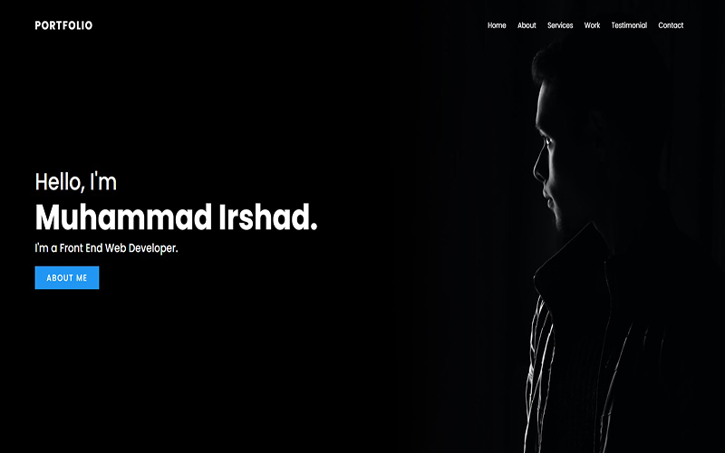
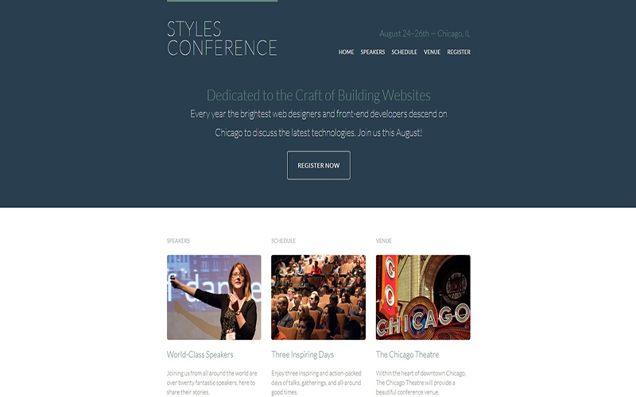
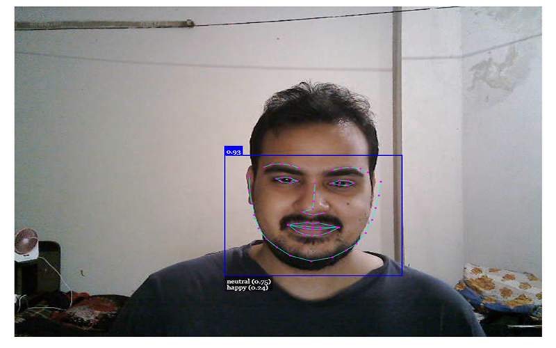

# Hafizul Haque's Web Dev Portfolio

Click on this link to [See Live Demo](https://hafizulhaque.github.io/Portfolio/
).

---

---

## Featured Web Projects

**10 of my web projects are showcased here..**

> ### [Project-01: Landing Page: CUET Central Library](https://hafizulhaque.github.io/Portfolio/resources/CUET%20Library%20Homepage/index.html)

Did this page design as a assignment on DBMS course. Implemented this web interface and worked with database in the backend. Although only the landing page of Central Library, CUET is shown here.

---

> ### [Project-02: Web Developer Portfolio Page](https://hafizulhaque.github.io/Portfolio/resources/Portfolio%20Page/index.html)

Developed this cool looking web developer page as a fun project. Pure CSS was used, no CSS library, i.e: bootstrap, materialize was used. Applied some attractive transition effect.

---

> ### [Project-03: Web Page for Conference Event](https://hafizulhaque.github.io/Portfolio/resources/Style%20Conference%20Site/index.html)

Implemented this professional looking website as a requirement of a web design online course conducted by Shay Howe. A lot variety of elements such as map, SEO techniques were applied.

---

> ### [Project-04: Photo Gallery Page](https://hafizulhaque.github.io/Portfolio/resources/Photo%20Gallery/index.html)

This page was developed for the purpose of gaining parctical hand-on experience on real life use of CSS Flexbox. Implemented this Image gallery using only flexbox, no css framework.

---

> ### [Project-05: Personal Blog Demo](https://hafizulhaque.github.io/Portfolio/resources/Sample%20Blog%20Website/index.html)

This is one of my early days design page developed using purely HTML, CSS, javascript. Font Awesome Icons were used. This blog post website can be used as a template by dynamically populating data by fetching from server.

---

> ### [Project-06: Webcam Input-Based Face Detection & Emotion Recognition Webapp](https://hafizulhaque.github.io/Portfolio/resources/Realtime-FaceDetection-Webapp/index.html)

This is an Machine learning based project. From webcam input we can detect human face in realtime and determine mood, i.e, happy, sad, surprised. We used face-api API to add machine learing capability to our cool web application.

---

> ### [Project-07: HTML-Canvas: Mouse Event Particle Effect](https://hafizulhaque.github.io/Portfolio/resources/Particle%20Effect/index.html)

Developed this Mouse Event based Particle effect javascript fun project. We implemented those particle effect in HTML5 canvas. It adds some facinating effect to a page.

---

> ### [Project-08: Vanilla JS Project: Web Piano](https://hafizulhaque.github.io/Portfolio/resources/Web%20Piano/index.html)

This is a click-play web piano app. Implemented this web appliacation to gain some hand on experience of vanilla javascript. No framework was used. Design of this page was simply done using CSS. And for dynamic rendering and logic we used vanilla javascript.

---

> ### [Project-09: React JS Project: Task Tracker App](https://hafizulhaque.github.io/react-todo-app/)

This is a React Task Tracker Project. Did this porject to learn react concepts like hooks, states, state-lifting, react-router etc. practically. This really cool looking react website works pretty well.

---

> ### [Project-10: Frontend: Blockchain-Based Malware Detection App](https://hafizulhaque.github.io/Portfolio/resources/blockchain-maldect-app/index.html)

This is the implemented frontend for Malware Detection application using Ethereum blockchin and Support Vector Machine (SVM) algo in the backend. Did this to prototype my final year thesis work.

---

*Thanks for visiting upto this point so patiently! See ya not for mind (^_^)*

